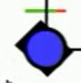
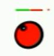
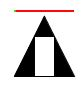

# Processing creations
This repository contains some of my work when I started learning programming.
Processing is a great framework based on Java programming language. It is popular because of the simple sintax and the power to create amazing visual programs from a few lines of code.
Processing is mostly used in education.
When I began to be interested in artificial intelligence and how to model the real world, I came across a great online book called  [The Nature of Code](http://natureofcode.com/book/introduction/) written by Daniel Shiffman. There I found how genetic algorithms work and how to make a "rocket" evolve to reach it's destination in a 2D world.

Therefore I present here my self-assigned projects that helped me understand programming:
! Note: Everything is pretty much handcoded. I do not have experience with game engines and what do they offer but here except matrix rotations everything is coded by hand with vector operations.

## 1. Finnaly the snake
The title comes from my frustration that I had while programming this.
The ideea is that I wanted to program a snake that has a smooth motion while chasing the mouse.

## 2. Circle Quare Hexagon
Here I tried to reproduce a video a found online but I did not succeded with the hexagon which should have been found in the third row.

## 3. Cannonball
Here I learned about particle systems and how to create nice explosion effects by hand.
This game has 4 balls that are launched. At the end of each ball life it is placed back in the cannonball.
If the ball hits the moving target, it is transofmed into particles that have an increased lifespan. At the end of the particle lifespan, the ball is placed back in the cannonball.

## 4. 2D-Virtual-World-Simulator
Fancy title for a simple game wannabe.
Here I wanted to implement genetic algorithms into a 2d environment where agents are able to reproduce and evolve. There are multiple types of "workes". Here are some pictures: food worker, resource worker, defender,and a predator

There are also mutiple types of buldings:
The armory is for defenders. The armory gives the capacity to the city to sustain a number of defender, precisely 4 defenders per armory.

The food deposit is where the food workers store their load. Also every worker comes to eat here to replenish HP points because they get hungry.

The resource deposit is where the resource workers store their load. It was supposed that with these resources new buildings could be constructed, but this feature was left unimplemented.

The mating hall is where workers come when they reach their mating age. They wait for another worker and a new random worker is created. The new worker had attributes stored in a DNA that was inherited from both parents.

There are also two types of resources:
Food

Resources

Each of these agents have some properties like Health Points, mating age (when reached they go the mating hall and wait for somebody to create a random new worker), attack power(only defenders can attack), carry capacity (only for food workers and resource workers).
There is also a chief defender(has a red dot on him) that was supposed to create buildings, but this feature wss left unimplemented.
Each defender has a visibility range and are able to patrol and look for predators.

Here is the final result:

