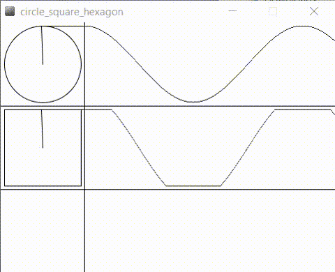

# Processing creations
This repository contains some of my work when I started learning programming.
Processing is a great framework based on Java programming language. It is popular because of the simple sintax and the power to create amazing visual programs from a few lines of code.
Processing is mostly used in education.
When I began to be interested in artificial intelligence and how to model the real world, I came across a great online book called  [The Nature of Code](http://natureofcode.com/book/introduction/) written by Daniel Shiffman. There I found how genetic algorithms work and how to make a "rocket" evolve to reach it's destination in a 2D world.

Therefore I present here my self-assigned projects that helped me understand programming:
! Note: Everything is pretty much handcoded. I do not have experience with game engines and what do they offer but here except matrix rotations everything is coded by hand with vector operations.

## 1. Finnaly the snake
The title comes from my frustration that I had while programming this.
The ideea is that I wanted to program a snake that has a smooth motion while chasing the mouse.

## 2. Circle Quare Hexagon
Here I tried to reproduce a video a found online but I did not succeded with the hexagon which should have been found in the third row.

## 3. Cannonball
Here I learned about particle systems and how to create nice explosion effects by hand.
This game has 4 balls that are launched. At the end of each ball life it is placed back in the cannonball.
If the ball hits the moving target, it is transofmed into particles that have an increased lifespan. At the end of the particle lifespan, the ball is placed back in the cannonball.

